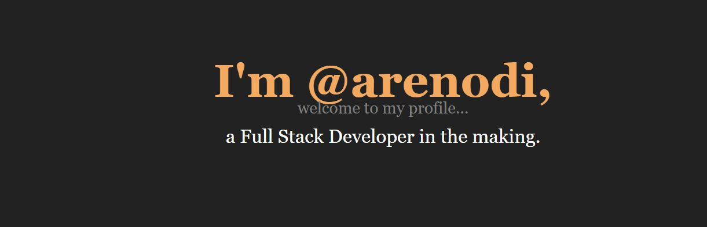

## About me

I'm arenodi, an industrial worker giving his best to get into the Tech Industry.

### Skills:

- 
- 
- 
- 
- 
- 
- 
-  (getting the hang of it)
- 
- 
- 

## My Projects

Heres a list of some of my projects and learning trails.

- [Rodizio-Porteiros](https://github.com/arenodi/rodizio-porteiros) 

- [freeCodeCamp](https://github.com/arenodi/free-code-camp) 
